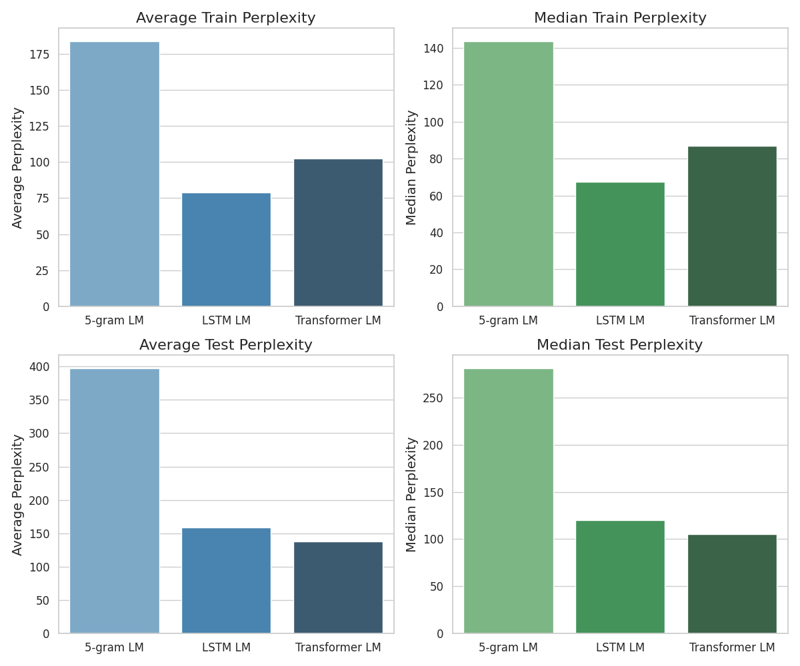
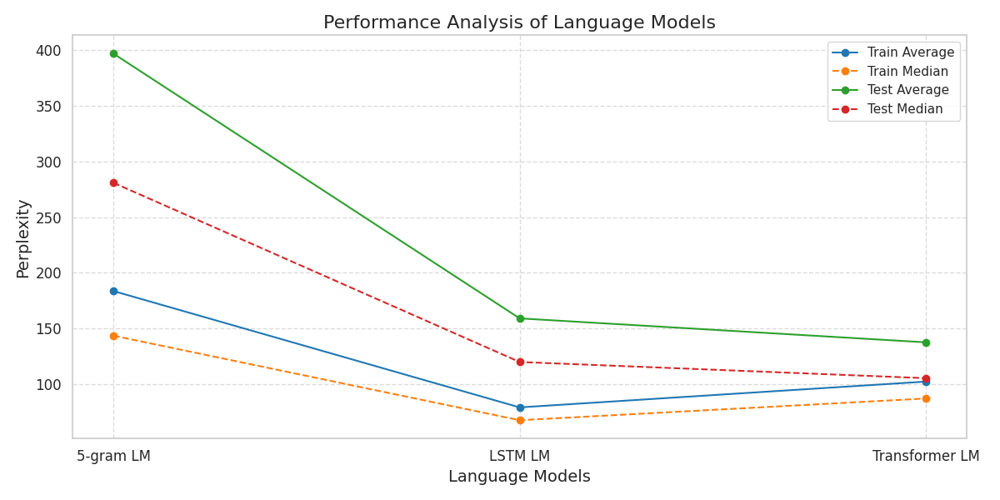

# Language Modelling Analysis

## Overview

We here present a comparative analysis of three language models trained on the `Auguste_Maquet` dataset. The models are as follows:
1. LM-1: 5-gram based language model
2. LM-2: LSTM based language model
3. LM-3: Pure Transformer Decoder based language model

The analysis is based on the perplexity scores obtained from both training and test sets from the same dataset.

## Performance Comparison

### Training Set Performance

| Model | Average Perplexity | Trimmed Average Perplexity | Median Perplexity |
|-------|--------------------|-----------------------------|-------------------|
| LM-1  | 1425.65            | 183.65                      | 143.50            |
| LM-2  | 164.45             | 79.03                       | 67.50             |
| LM-3  | 214.12             | 102.24                      | 87.04             |

### Test Set Performance

| Model | Average Perplexity | Trimmed Average Perplexity | Median Perplexity |
|-------|--------------------|-----------------------------|-------------------|
| LM-1  | 77008.06           | 397.12                      | 280.96            |
| LM-2  | 16002.66           | 159.06                      | 119.85            |
| LM-3  | 8105.63            | 137.53                      | 105.29            |

The above figure shows a comparison of average and median perplexities for both training and test sets across all three models.

## Analysis

1. **Training Set Performance**:
   - LM-2 (LSTM) shows the best performance on the training set across all metrics.
   - LM-3 (Transformer) performs slightly worse than LM-2 but significantly better than LM-1.
   - LM-1 (5-gram) has the poorest performance, with much higher perplexity scores.

2. **Test Set Performance**:
   - LM-3 (Transformer) demonstrates the best generalization to unseen data, with the lowest perplexity scores across all metrics on the test set.
   - LM-2 (LSTM) performs slightly worse than LM-3 but significantly better than LM-1.
   - LM-1 (5-gram) shows the poorest generalization, with extremely high perplexity scores.

3. **Experiments & Overfitting Analysis**:
   - LM-1 originally indicated high overfitting, because the validation scores tended to increase after only 2 epochs as the training scores decreased. This was due to the model's simplicity and inability to capture complex patterns.
   - To address this issue, two things were done:
     - A dropout layer was added to ensure that the model generalizes better to unseen data.
     - Ridge regularization (L2 regularization) was added to the model to prevent overfitting.
     - These changes significantly improved the model's performance, as evidenced by the fact that the validation scores also decrease gradually alongside the training scores as the model trains across multiple epochs.
   - LM-2 and LM-3 show weaker signs of overfitting, with the validation scores following the training scores more closely. This suggests that the more complex models are better able to generalize to unseen data.

4. **Distribution of Perplexity Scores**:
   - The large differences between average and trimmed average perplexities indicate the presence of outliers in the perplexity scores for all models. This was handled the trimming the outliers ($0.1\%$ of the data) before calculating the trimmed average.
   - Median perplexities are consistently lower than averages, indicating right-skewed distributions of perplexity scores.

5. **Model Complexity and Performance**:
   - The more complex models (LM-2 and LM-3) significantly outperform the simpler 5-gram model (LM-1).
   - The Transformer-based model (LM-3) shows better generalization than the LSTM-based model (LM-2).

The above figure provides a comprehensive view of the performance analysis across all models and metrics.

## Conclusions

1. **Best Overall Model**: LM-3 (Pure Transformer Decoder) demonstrates the best overall performance, particularly in terms of generalization to unseen data. Its architecture allows it to capture long-range dependencies effectively while avoiding gradient issues.

2. **Overfitting**: All models show signs of overfitting, with LM-1 being the most severe. 

3. **Model Complexity**: The results clearly show that more complex models (LSTM and Transformer) outperform the simpler 5-gram model, justifying the use of advanced neural architectures for language modeling tasks.

4. **Outliers and Data Distribution**: The presence of outliers and right-skewed distributions of perplexity scores suggest that median and trimmed average metrics are more reliable indicators of model performance than simple averages.